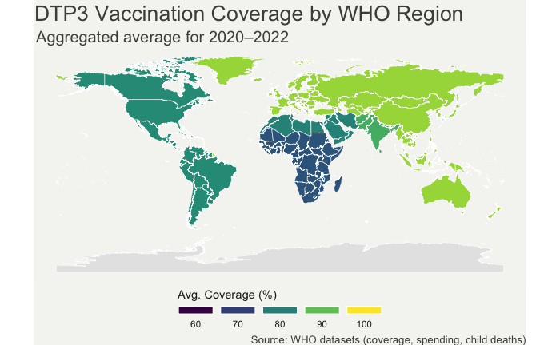
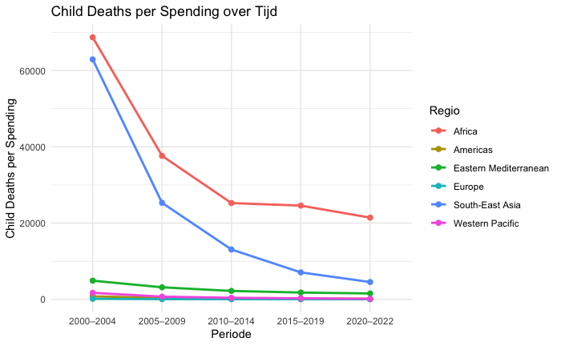
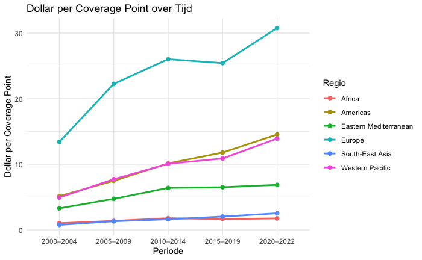

```{r package_install, include=FALSE}
#options(repos = c(CRAN = "https://cloud.r-project.org"))
#install.packages("tidyverse")
#install.packages("readxl")
#install.packages("sf")
#install.packages("rnaturalearth")
#install.packages("rnaturalearthdata")
#install.packages("ggplot2")
#install.packages("viridis")
#install.packages("grid")
#install.packages("countrycode")
```

```{r Setup pdf}
install.packages(c("renv", "tinytex"))

# 1. restore the exact package versions used by the course
renv::restore()        # looks at renv.lock

# 2. check whether a LaTeX compiler is already present
has_tex <- tinytex::is_tinytex() || nzchar(Sys.which("pdflatex"))

if (!has_tex) {
  os <- Sys.info()[["sysname"]]
  message("No LaTeX found → installing TinyTeX for ", os)
  tinytex::install_tinytex()     # ~250 MB, 100 % automatic
  message("Restart RStudio after installation finishes.")
}

```

```{r setup, include=FALSE}
library(tidyverse)
library(readxl)
library(dplyr)
library(sf)
library(rnaturalearth)
library(rnaturalearthdata)
library(ggplot2)
library(viridis)
library(grid)
```


---

**Tutor:** J.F. Fitzgerald  
**Tutorial Group:** Tutorial group 1  
**Course:** Programming for Economists  
**Institute:** Vrije Universiteit Amsterdam

---

# Problem Motivation and Literature

## Why is DTP Vaccination a Social Problem?

DTP vaccination, protecting against diphtheria, tetanus, and pertussis, is a cornerstone of global public health. It is one of the most cost-effective interventions, preventing an estimated 4.4 million deaths annually (UNICEF, 2024). Despite its proven effectiveness and inclusion in nearly all national immunization schedules, millions of children worldwide remain under-vaccinated or entirely unvaccinated. In 2023 alone, approximately 21 million children were either unvaccinated or under-vaccinated, with 14.5 million receiving no vaccines at all (UNICEF, 2024). This gap in coverage leads to preventable illness, long-term disability, and death, particularly in low- and middle-income countries (Our World in Data, sd). The issue is not merely medical but deeply social, as it reflects and reinforces inequalities in access to healthcare, education, and infrastructure (UNICEF, 2024).

Vaccination coverage is also a proxy for the strength of a country’s healthcare system. Low DTP coverage often signals broader systemic issues such as poverty, conflict, misinformation, and weak governance. These factors disproportionately affect vulnerable populations, making DTP vaccination a critical indicator of social justice and equity (UNICEF, 2024).

## Research Question

**"How does government healthcare spending per capita correlate with national vaccination coverage rates for routine immunizations in low-, middle-, and high-income countries?"**

## Sources Identifying DTP Vaccination as a Social Problem

- The **World Health Organization (WHO)** and **UNICEF** have jointly warned that vaccine-preventable diseases, including diphtheria, are resurging due to declining immunization coverage, misinformation, and funding cuts. They emphasize that millions of children are at risk, and urgent investment in immunization is needed to prevent a reversal of decades of progress (WHO Media Team, 2025).

- **UNICEF** outlines the severe consequences of DTP-preventable diseases. Diphtheria can cause heart and nerve damage, tetanus is often fatal even with treatment, and pertussis can lead to pneumonia and death in infants. These diseases disproportionately affect children in low-resource settings, highlighting the social dimension of under-vaccination (UNICEF, sd).

- A **UNICEF data report** on DTP vaccine dropout rates shows that millions of children start but do not complete the DTP series. This dropout is especially prevalent in low-income countries and is linked to systemic barriers such as healthcare access, education, and infrastructure (Wang et al., 2019).

## What Has Not Been Fully Researched

While many studies have examined DTP coverage and its determinants, there is limited comparative analysis across income groups that links government healthcare spending per capita directly to national DTP vaccination rates. Most existing research focuses on either micro-level determinants (e.g., parental education, rural access) or macro-level trends without integrating economic policy variables. UNICEF notes that while DTP3 coverage is widely used as a marker of how well countries provide routine immunization, disparities persist, and economic factors such as national healthcare investment are often underexplored in comparative frameworks (UNICEF, 2024).

## Contribution of This Report

This report aims to fill that gap by analyzing how government healthcare spending correlates with DTP vaccination coverage across low-, middle-, and high-income countries. This research will provide new insights into whether increased public investment in health translates into better immunization outcomes. This could inform both global health policy and economic development strategies, especially in resource-constrained settings.

---

# Data Sourcing

## Load in Data

```{r Load in data}

url_spending <- "https://www.dropbox.com/scl/fi/01df0ly3ornjgcis9kwsk/CHE-per-region.csv?rlkey=nwvmxv33dc3uvp9pnil4tqimk&st=5zgoazd8&dl=1"

url_coverage <- "https://www.dropbox.com/scl/fi/08rf7e6sj3hcq3e5fnp8l/datasetcoverage.xlsx?rlkey=x9iwcifdi2vmqa3j4oy1zs7p3&st=g5kdhaib&dl=1"

url_childdeath <- "https://www.dropbox.com/scl/fi/wuopfxxyux4dccc9rbibn/child-death.csv?rlkey=mfqw1b76522vtjqxcz7grvtmb&st=v0q288at&dl=1"
```

### Data Source Credibility

Source 1: DTP Vaccination Coverage

- Credibility: This dataset is published by the WHO/UNICEF Estimates of National Immunization Coverage (WUENIC), the leading global authority on public health. WHO collaborates with national governments and UNICEF to compile and validate immunization data (World Health Organization, 2024).
- Data Quality: The data is based on a combination of administrative data, household surveys, and expert review. This triangulation improves accuracy and reliability.
- Relevance: It directly provides the DTP3 coverage rates, which are central to the research question. The data is also disaggregated by region and year, allowing for temporal and cross-regional analysis.

Source 2: Government Healthcare Spending

- Credibility: The World Bank is a globally respected institution that provides standardized economic and development data. It sources health expenditure data from the WHO Global Health Expenditure Database (World Bank, 2024).
- Data Quality: The data is collected using internationally accepted methodologies and is updated annually. It includes consistent country-level indicators, making it ideal for cross-country comparisons.
- Relevance: This dataset provides the independent variable in the analysis—government health spending per capita—which is used to explore its correlation with vaccination coverage.

Source 3: Child Death Rates

- Credibility: This data is also from the World Health Organization, specifically its Global Health Observatory (GHO), which is the main repository for WHO’s health-related statistics (World Health Organization, 2024).
- Data Quality: The under-five mortality data is compiled from national vital registration systems, surveys, and statistical modeling, and is reviewed by global health experts.
- Relevance: While not part of the main correlation analysis, this dataset provides valuable contextual insight into the broader social impact of vaccination coverage and healthcare investment.

## Provide a short summary of the datasets
```{r Convert data, include=FALSE}
# Download het bestand tijdelijk en lees het in
temp_file <- tempfile(fileext = ".xlsx")
download.file(url_coverage, destfile = temp_file, mode = "wb")
df <- read_excel(temp_file)

# Read the CSV into a dataframe
raw_healthspending_data <- read.csv(url_spending)
raw_healthspending_data <- raw_healthspending_data %>%
select(Indicator, Location, Period, Value)


# Read the CSV into a dataframe
raw_childdeath_data <- read.csv(url_childdeath)
```

```{r summary data, echo=FALSE}
head(raw_healthspending_data)
head(df)
```

## Metadata

### WHO DTP Vaccination Coverage

- **Antigen:** DTP1 and DTP3  
- **Coverage:** Vaccinated target population  
  - **Units:** Percentage  
- **Target Population:** Target population for the given vaccine  
- **Years Covered:** 1980–2023  
- **Region:** WHO regions  
- **Frequency:** Annual  
- **Source:** WHO/UNICEF Joint Reporting Form and surveys (e.g., DHS, MICS)  
- **Estimation Method:** Combination of administrative data, surveys, and expert review  

### World Bank Health Spending

- **Indicator:** Current health expenditure per capita  
- **Years Covered:** 2000–2023  
- **Region:** WHO regions  
- **Frequency:** Annual  
- **Units:** US dollars  
- **Source:** WHO Global Health Expenditure Database  

## Suitability for the Research Topic

The research question investigates the relationship between government healthcare spending and DTP vaccination coverage across income groups. These datasets are ideal because:

- They are comprehensive and global, enabling cross-country comparisons.  
- They are updated annually, supporting time-series or cross-sectional analysis.  
- They are standardized and well-documented, ensuring data quality and reproducibility.  

## Data Limitations

Despite their strengths, both datasets have limitations:

### WHO DTP Coverage

- Some countries have missing or estimated values, especially in conflict zones.  
- Coverage estimates may be influenced by reporting biases or survey recall errors.  
- The data may not fully reflect subnational disparities in vaccination access.  

### World Bank Health Spending

- Spending data are in current US dollars, which may be affected by inflation and exchange rate fluctuations.  
- The data do not indicate how funds are allocated (e.g., toward immunization vs. other services).  
- Some countries have incomplete or outdated records for recent years.  

These limitations mean that while the analysis can reveal correlations, it cannot establish causality or account for all contextual factors.

---

# Quantifying

## Data Cleaning

To prepare the datasets for analysis, we performed several cleaning steps to ensure consistency, accuracy, and compatibility across sources.

### Health Spending Data

We began by selecting the relevant columns from the raw health spending dataset and renaming them for clarity. We also ensured that the `Year` and `Spending` columns were numeric to support time-based analysis. This step was essential to align the data with the DTP vaccination dataset, which also uses `Region` and `Year` as key identifiers.

### DTP Vaccination Coverage Data

Next, we filtered the immunization dataset to include only WHO regions and WUENIC estimates, which are considered the most reliable. We also created a new variable, `PeriodGroup`, to group years into meaningful intervals for trend analysis. This transformation allows us to analyze changes in vaccination coverage over time in a more interpretable way.

### Child Mortality Data

We also prepared the child mortality dataset by selecting and renaming relevant columns, and converting values to numeric types. This ensures that the dataset can be merged with the others on `Region` and `Year`.


### Error Handling and Fixes

During the cleaning process, we encountered several common issues:

- **Missing values (`NA`)**: These were removed using `na.omit()` or filtered out using `filter(!is.na(...))` to ensure clean merges.
- **Non-numeric values**: Some columns were read as character types and had to be converted using `as.numeric()`.
- **Inconsistent region names**: We verified that region names matched across datasets. In an ideal scenario, standardized region codes (e.g., ISO or WHO codes) would be used to avoid ambiguity.
- **Data alignment**: We ensured that all datasets used the same time format and level of aggregation (annual, by WHO region).

## Necessary Variable

To analyze trends over time, we created a **period variable** for each dataset to group years into meaningful intervals. This allows us to compare average values across consistent time blocks.

### Health Spending

We created a new variable `Period` in the health spending dataset using `mutate()` and `case_when()`. We then calculated the **average health spending** per region and period.

- **Variables used**: `Spending`, `Region`, `Period`  
- **Purpose**: Calculates average health spending per region and period.  
- **Usefulness**: Highlights regional differences and trends in health investment.  
- **Intended analysis**: Visualize and compare health spending across time and regions.

### DTP Vaccination Coverage

For the DTP dataset, we used an existing variable `PeriodGroup` (created earlier) and calculated the **average vaccination coverage** per region and period.

- **Variables used**: `Coverage`, `Region`, `PeriodGroup`  
- **Purpose**: Computes average DTP vaccine coverage per region and period.  
- **Usefulness**: Evaluates immunization program effectiveness.  
- **Intended analysis**: Track vaccine coverage trends and relate to health outcomes

### Child Mortality

We also created a `Period` variable for the child mortality dataset. We then summarized the **average number of child deaths** per region and period:

- **Variables used**: `Deaths`, `Region`, `Period`  
- **Purpose**: Calculates average child deaths per region and period.  
- **Usefulness**: Measures health outcomes and can be linked to spending and coverage.  
- **Intended analysis**: Identify regions with high or declining child mortality and explore correlations.

These variables allow us to compare trends in health spending, vaccination coverage, and child mortality across WHO regions and over time.

## Merging Datasets

To analyze the relationship between healthcare spending, DTP vaccination coverage, and child mortality, it was necessary to combine all three datasets into a single, unified structure. This required several preparatory steps:

Standardizing Region Names
The Region variable in the DTP dataset used full WHO region names (e.g., "African Region"), while the other datasets used shorter or slightly different labels (e.g., "Africa"). To ensure consistency, I used mutate() and recode() to align the region names across datasets:

Merging the Datasets
I used inner_join() to merge the three datasets by Region and Period. This ensures that only rows with matching region-period combinations across all datasets are included:

Creating New Variables
To enrich the analysis, we constructed new variables that express relationships between the indicators:

Final Formatting
The merged tibble was converted to a standard data frame for compatibility with certain functions:

This merged dataset forms the foundation for the correlation analysis and visualizations that follow.

---

# Visualization

## Spatial Visualization

```{r echo=FALSE, out.width="80%"}

```

### Spatial Analysis of DTP3 Vaccination Coverage (2020–2022)

This world map visualizes average DTP3 vaccination coverage by WHO region from 2020 to 2022, using a color gradient from purple (60%) to yellow (100%). The map reveals clear regional disparities: high-income regions such as Europe and the Western Pacific generally exhibit higher coverage (light green to yellow), while lower-income regions like Africa and parts of the Eastern Mediterranean show lower coverage (purple to blue). 

#### Spatial Anomalies and Regional Comparisons

Notably, some middle-income regions, such as parts of South-East Asia, achieve relatively high coverage despite lower spending levels, suggesting efficient immunization programs. Conversely, certain countries in the Americas show unexpectedly moderate coverage despite higher average spending, indicating potential inefficiencies or access barriers.

#### Interpretation and Mapping Critique

The map effectively communicates broad regional trends but may obscure within-region variation due to aggregation. For example, large countries with internal disparities (e.g., India, Brazil) are represented by a single color, which may oversimplify complex national dynamics. Additionally, the use of discrete color bands may exaggerate differences between countries near category thresholds.

#### Mapping Choices

While the color scheme is intuitive and accessible, a continuous gradient or country-level granularity could enhance interpretability. Including data labels or interactive elements (in a web-based version) would further support detailed analysis. Despite these limitations, the map serves as a compelling visual summary of global immunization equity and supports the research question by highlighting spatial patterns in vaccination coverage relative to regional healthcare investment.


## Temporal Visualization


```{r echo=FALSE, out.width="80%"}

```


```{r echo=FALSE, out.width="80%"}

```


### Temporal Trends in Health Investment and Outcomes

These two line graphs visualize how healthcare efficiency and outcomes have evolved across WHO regions over five-year periods from 2000 to 2022. They align closely with the research question by showing how healthcare spending relates to vaccination coverage and child mortality over time.

#### Graph 1: Child Deaths per Spending over Time

- **What it shows**: The number of child deaths per unit of healthcare spending.
- **Trend**: A clear downward trend across all regions, indicating improved outcomes per dollar spent.
- **Notable pattern**: Africa and Europe show the most significant declines, suggesting major gains in healthcare efficiency or effectiveness.
- **Interpretation**: This trend reflects global progress in reducing child mortality, likely due to better-targeted spending, improved healthcare delivery, and expanded immunization coverage.

#### Graph 2: Dollar per Coverage Point over Time

- **What it shows**: The average cost (in USD) required to increase DTP3 vaccination coverage by one percentage point.
- **Trend**: Most regions show a relatively stable or slightly increasing cost over time.
- **Notable pattern**: The Western Pacific region shows a significant increase in cost per coverage point in recent years, suggesting rising marginal costs or reduced efficiency.
- **Interpretation**: While some regions maintain cost-effectiveness, others may be facing diminishing returns on investment in immunization programs.

#### Comparison and Dynamics

- **Efficiency vs. Outcome**: While the cost of achieving additional vaccination coverage is rising or stabilizing, the impact of spending on reducing child deaths is improving.
- **Temporal Insight**: These trends highlight the evolving dynamics of global health investment—where spending may be increasing, but so is its effectiveness in saving lives.

#### Implications

- Policymakers should consider both cost and outcome metrics when evaluating healthcare strategies.
- The rising cost per coverage point in some regions may call for more efficient delivery models or targeted interventions.
- The declining child deaths per spending metric is a positive signal of global health progress and a justification for continued investment.


## Sub-Population Visualization


```{r echo=FALSE, out.width="80%"}
knitr::include_graphics("subpopulation.png")
```

### Subgroup Analysis: Top vs Bottom 3 WHO Regions (2022)

This bar chart compares the top 3 and bottom 3 WHO regions based on average healthcare spending per capita in 2022. It visualizes three key metrics:

- **Average Health Spending (USD per capita)**
- **Average DTP3 Vaccination Coverage (%)**
- **Average Child Deaths**

#### Alignment with Research Topic

This visualization directly supports the research question:  
*"How does government healthcare spending per capita correlate with national vaccination coverage rates for routine immunisations?"*

By dividing regions into high- and low-spending groups, the plot highlights how investment levels relate to health outcomes across sub-populations.

#### Group Differences (Quantified)

| Metric       | Top 3 Regions | Bottom 3 Regions | Difference       |
|--------------|----------------|------------------|------------------|
| Spending     | \$1852.7       | \$305.9           | +\$1546.8        |
| Coverage     | 91%            | 82%               | +9%              |
| Child Deaths | 149,154.7      | 1,516,736.3       | −1,367,581.6     |

- Top 3 regions spend over **6 times more** per capita on healthcare.
- They achieve **9 percentage points higher** vaccination coverage.
- They experience nearly **10 times fewer** child deaths.

#### Evaluation of Subgroup Analysis

This subgroup comparison reveals a clear gradient: higher spending is associated with better vaccination outcomes and significantly lower child mortality. The differences are not only statistically meaningful but also socially and ethically significant, especially in the context of global health equity.

#### Implications

- **Policy Insight**: The data suggests that increasing healthcare investment in underfunded regions could substantially improve immunization coverage and reduce child mortality.
- **Equity Concern**: The stark contrast in child death rates underscores the urgent need for targeted support in low-spending regions.
- **Further Research**: This analysis invites deeper exploration into how efficiently funds are used and what other systemic factors (e.g., governance, infrastructure) influence outcomes.


## Event Analysis

Applying the findings related to the correlation between government healthcare spending per capita and national vaccination coverage rates worldwide, we can analyse a critical event period from 2020 to 2022 which relates to the COVID-19 pandemic. Unlike gradual policy reforms during the 2010-2014 period such as GAVI's (source https://www.gavi.org/our-alliance/strategy/phase-3-2011-2015) innovative financing mechanisms which introduced market-based incentives to lower vaccine pricing and availability structure, the pandemic created an acute simultaneous shock to every healtchare system worldwide. This situation enables a unique opportunity to examine how external crises affect government healthcare spending per capita and national vaccination coverage rates worldwide.

During COVID-19 routine immunizations were suspended or decreased as worldwide healthcare systems had to respond to the pandemic, meaning that regardless of funding levels directed to vaccinations, their coverage still dropped. (source https://www.who.int/news/item/22-05-2020-at-least-80-million-children-under-one-at-risk-of-diseases-such-as-diphtheria-measles-and-polio-as-covid-19-disrupts-routine-vaccination-efforts-warn-gavi-who-and-unicef).

Due to global lockdowns and border restrictions another major disruption was on the supply chain, as the struggle to transport vaccinations across borders and maintain cold storage systems increased, leading to decreased vaccination availability. Increasingly relevant to this study, a decrease in 7.7% DTP3 vaccine coverage worldwide was recognized compared to expected doses delivered in the absence of COVID. (source https://www.thelancet.com/article/S0140-6736%2821%2901337-4/fulltext)

The child deaths per spending data reveals a steady improvement trajectory up until before COVID-19 where regions started to show signs of stagnation. African regions kept stable child deaths per spending through the pandemic which suggests this region had resilience strategies such as communtiy health worker programs which focused on under-five care while more formal systems were focused on COVID related health issues. Regardless of staffing shortages and movement restriction, these pre-established networks prevented many childrens' deaths in this region. (source https://pubmed.ncbi.nlm.nih.gov/38963883/) This data might however have overstated results as it may reflect COVID-19 related deaths and healthcare access disruptions which caused an increased number of infant mortality, complciating the interepretation of spending efficiency across this time period.

The global coverage map strucks with regional disparities during the 2020-2022 period, ranging from 60% to close to 100% in some WHO regions. This suggests that pre-existing health care systems' resilience and adaptive mechanisms worldwide varied greatly upon facing the pandemic. Whereas most childhood vaccines declined in coverage worldwide, it was more prominent in low and lower-middle income countries (source https://pmc.ncbi.nlm.nih.gov/articles/PMC10249397/?) , which reinstates that more developed countries with better precautionary health systems can keep a more stable vaccination coverage even during more strenuous moments on the healthcare system.

Similarly the comparison between subpopulations shows how bottom performing regions, namely africa, maintained a 82% coverage during the pandemic while top performing regions achieved 91%. This data aligns with the previous graph, showing that stronger health systems in Europe can much better mitigate coverage maintenance challenges compared to African regions. 

Finally, the dollar per coverage point data shows a sudden spike in costs, which suggests that it became much more expensive to maintain coverage during the pandemic. The aforementioned supply chain disruption provides an explanation to this spike. Service suspensions and supply-chain delays caused vaccination volumes to drop, meaning that the delivery costs such as personnel and cold chains had to be spread over fewer doses, signficantly increasing the per-point cost. 


### Interpretation and Relevance

Over the course of the analysis of the relation between all four graphs and COVID-19, strong temporal evidence has come to light, hinting a pandemic-related causation rather than coincidental trends. This challenges theories which assume stable and linear relationships between government healthcare spending and vaccination coverages. Three key insights emerge from the analysis:

Crisis-state exception: Traditional vaccination coverage models operate under the assumption of stability and predictability, meaning that major disruptions such as COVID-19 can crumble healthcare systems if these are not equipped with dynamic frameworks addressing both normal and crisis-states.

System resilience hierarchy: An unrecognized hiearchy of system resilience between regions emerged with this study, slicing through traditional income classifications. Community-based delivery systems such as the ones in Rwanda and Bangladesh (source https://pubmed.ncbi.nlm.nih.gov/38963883/) demonstrated certain poorer areas have superior crisis adaptability compared to other highly bureacratic systems in richer countries. This insights allows for the discussion diving into the potential vulnerability that comes with highly institutionalized systems.

Resource Mobilization Capacity: The cost spike related to supply chain disruptions highlights the importance of rapidly scaling spending in response to crises. Similar to Keynes' view, this insight challenges static spending-outcome models by introducing varied increase in resources as a better option.

One key takeaway from the study is how resilient delivery systems are key to react to sudden disruptors. The superior performance of community-based systems might lead to conversations on how even more developed countries should emphasize on decentralized, locally-controlled delivery mechanisms to maintain healthcare standards during major events. 

Furthemore over-sophisticated health systems and its shortcomings could direct policy makers to evaluate the efficiency advantages or disadvantages of complex and integrated systems. Finally, the varied regional responses to the pandemic era disclose poor international coordination, with each region managing responses independently. Advocating once more for more flexible, decentralized international response frameworks. 

# Discussion

Our most significant finding was that sophisticated, well-funded healthcare systems suffered the greatest efficiency losses during the pandemic, whereas simpler, less-funded systems proved resilience. Europe maintained >90% coverage but had dramatic cost increases from $25 to $31 per coverage point during COVID. On the other hand, african regions maintained stable child deaths per spending ratios despite having the lowest spending levels.

Traditional income classifications were deemed flawed to predict pandemic resilience. In turn, system design characteristics such as degree of centralization and institutional complexity became the main differentiator between regions' adaptability to extremely impactful events. Community-based systems' adaptive capacity prevailed over highly institutionalized systems' tendency to create multiple failure points, requiring major resource mobilization.

Pre-pandemic data showed a predictable improvement amongst all regions, but when the pandemic struck, dramatic changes were observed that altered spending-outcome relationships. 

The findings of this study challenge core health economics assumptions and suggests the need for dynamic models, capable to adapt to stable and unstable environments. For policy implementation, the superior performance of community-based systems drags the topic of pandemic preparedness to a more decentralized approach. 

# Reproducibility

## Github repository link

## Refrence list

- WHO Media Team. (2025, April 24). Increases in vaccine-preventable disease outbreaks threaten years of progress, warn WHO, UNICEF, Gavi . Retrieved from World Health Organization:             https://www.who.int/news/item/24-04-2025-increases-in-vaccine-preventable-disease-outbreaks-threaten-years-of-progress--warn-who--unicef--gavi
- UNICEF. (n.d.). Vaccines and the diseases they prevent. Retrieved from UNICEF: https://www.unicef.org/parenting/health/vaccines-and-diseases-they-prevent
- Xinhu Wang; Mamadou Diallo. (2019, September 24). UNICEF. Retrieved from How tracking DTP vaccine dropout rates helps protect children from preventable diseases: https://data.unicef.org/data-for-action/tracking-dtp-vaccine-dropout-rates-protects-children-from-preventable-diseases/
- unicef. (2024, July). Immunization. Retrieved from unicef: https://data.unicef.org/topic/child-health/immunization/
- Our World in Data. (n.d.). Deaths caused by vaccine-preventable diseases, World. Retrieved from Our World in Data: https://ourworldindata.org/grapher/deaths-caused-by-vaccine-preventable-diseases-over-time
- UNICEF. (2024, March). Vaccination & Immunization Statistics - UNICEF Data. Retrieved from UNICEF: https://knowledge.unicef.org/resource/vaccination-immunization-statistics-unicef-data


