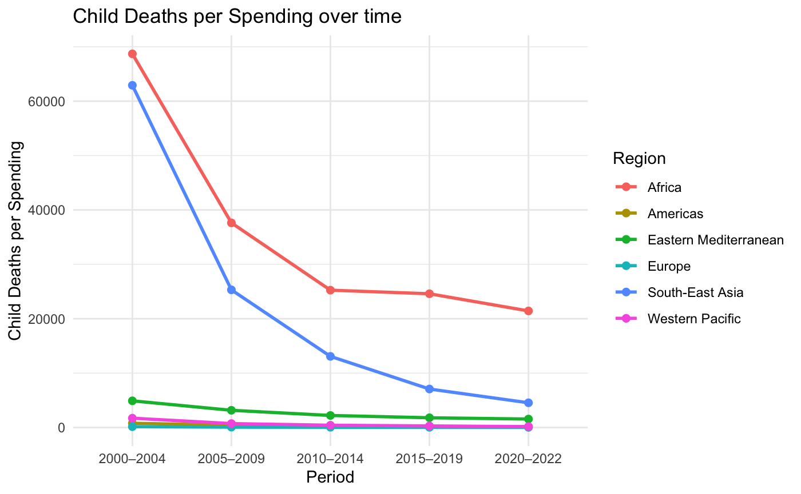

```{r include=FALSE}
## sets WD to the file’s folder when you hit ‘Run’ or ‘Knit’
if (requireNamespace("rstudioapi", quietly = TRUE) &&
    rstudioapi::isAvailable()) {
  setwd(dirname(rstudioapi::getActiveDocumentContext()$path))
}
```

```{r package_install, include=FALSE}
install.packages("tidyverse")
install.packages("readxl")
install.packages("sf")
install.packages("rnaturalearth")
install.packages("rnaturalearthdata")
install.packages("ggplot2")
install.packages("viridis")
install.packages("grid")
```

```{r packages, include=FALSE}
library(tidyverse)
library(readxl)
```


# Part 1 – Identify a Social Problem

## 1.1 Describe the Social Problem
DTP vaccination protects against diphtheria, tetanus, and pertussis and is one of the most cost-effective public health interventions, preventing an estimated 4.4 million deaths annually (UNICEF, 2024). Despite its inclusion in most national immunization programs, around 21 million children were under- or unvaccinated in 2023, with 14.5 million receiving no vaccines at all (UNICEF, 2024). This gap is most severe in low- and middle-income countries and reflects broader social inequalities in healthcare, education, and infrastructure (Our World in Data, n.d.; UNICEF, 2024).

Low DTP coverage often signals systemic issues such as poverty, conflict, and misinformation, making it a key indicator of healthcare system strength and social equity (UNICEF, 2024).

Research question: How does government healthcare spending per capita correlate with national DTP vaccination coverage across income groups?

## 1.2 Sources Identifying DTP Vaccination as a Social Problem
WHO and UNICEF warn of rising vaccine-preventable diseases due to declining coverage, misinformation, and funding cuts (WHO Media Team, 2025). DTP-preventable diseases remain deadly, especially in low-resource settings (UNICEF, n.d.). UNICEF data also show high dropout rates in DTP series completion, linked to systemic barriers like poor healthcare access and infrastructure (Wang et al., 2019).

## 1.3 Research Gap
While DTP coverage has been widely studied, few analyses directly link it to government healthcare spending across income levels. Most research focuses on micro-level factors or broad trends, often overlooking economic policy variables (UNICEF, 2024).

## 1.4 Contribution of This Report
This report explores the relationship between public healthcare spending and DTP coverage across income groups. It aims to provide insights into whether increased investment leads to better immunization outcomes, informing global health and development policy.


# Part 2 - Data Sourcing

## 2.1 Load in the data

Source 1 (DTP vaccination coverage): [https://immunizationdata.who.int/global/wiise-detail-page/diphtheria-tetanus-toxoid-and-pertussis-(dtp)-vaccination-coverage?CODE=AFR+EMR+EUR+AMR+SEAR+WPR&ANTIGEN=&YEAR=](https://immunizationdata.who.int/global/wiise-detail-page/diphtheria-tetanus-toxoid-and-pertussis-(dtp)-vaccination-coverage?CODE=AFR+EMR+EUR+AMR+SEAR+WPR&ANTIGEN=&YEAR=){.uri}

Source 2 (Government healthcare spending): [https://www.who.int/data/gho/data/indicators/indicator-details/GHO/current-health-expenditure-(che)-per-capita-in-us-dollar](https://www.who.int/data/gho/data/indicators/indicator-details/GHO/current-health-expenditure-(che)-per-capita-in-us-dollar){.uri}

Source 3 (Child death rates): <https://www.who.int/data/gho/data/indicators/indicator-details/GHO/number-of-under-five-deaths>

```{r include=FALSE}

# Load data on health spending  directly from Dropbox (public direct link)
url_spending <- "https://www.dropbox.com/scl/fi/01df0ly3ornjgcis9kwsk/CHE-per-region.csv?rlkey=nwvmxv33dc3uvp9pnil4tqimk&st=5zgoazd8&dl=1"

# Load data on health coverage  directly from Dropbox (public direct link)
url_coverage <- "https://www.dropbox.com/scl/fi/08rf7e6sj3hcq3e5fnp8l/datasetcoverage.xlsx?rlkey=x9iwcifdi2vmqa3j4oy1zs7p3&st=g5kdhaib&dl=1"

# Download the file temporarily and read it in
temp_file <- tempfile(fileext = ".xlsx")
download.file(url_coverage, destfile = temp_file, mode = "wb")
raw_coverage_data <- read_excel(temp_file)

# Load data on child deaths directly from Dropbox (public direct link)
url_childdeath <- "https://www.dropbox.com/scl/fi/wuopfxxyux4dccc9rbibn/child-death.csv?rlkey=mfqw1b76522vtjqxcz7grvtmb&st=v0q288at&dl=1"

# Read the CSV into a dataframe
raw_healthspending_data <- read.csv(url_spending)

# Read the CSV into a dataframe
raw_childdeath_data <- read.csv(url_childdeath)
raw_healthspending_data <- raw_healthspending_data %>%
select(Indicator, Location, Period, Value)

# Preview the first few rows to check the import
head(raw_healthspending_data)
head(raw_coverage_data)

```


## 2.2 Provide a short summary of the dataset(s)

```{r}
head(raw_coverage_data)
head(raw_healthspending_data)
```

**Source 1: DTP Vaccination Coverage**  
- **Credibility**: Published by WHO/UNICEF (WUENIC), the leading global authority on immunization data (World Health Organization, 2024).  
- **Data Quality**: Combines administrative records, surveys, and expert review, enhancing reliability.  
- **Relevance**: Provides DTP3 coverage rates by region and year—central to the research question.

**Source 2: Government Healthcare Spending**  
- **Credibility**: Provided by the World Bank, using WHO’s Global Health Expenditure Database (World Bank, 2024).  
- **Data Quality**: Based on standardized, internationally accepted methods; updated annually.  
- **Relevance**: Supplies the key independent variable—health spending per capita—for correlation analysis.

**Source 3: Child Death Rates**  
- **Credibility**: From WHO’s Global Health Observatory, a trusted source for global health statistics (World Health Organization, 2024).  
- **Data Quality**: Derived from national systems, surveys, and statistical modeling.  
- **Relevance**: Offers contextual insight into the broader social impact of vaccination and healthcare investment.

## 2.2.1 Complementarity of the Datasets
These datasets are complementary in structure and purpose:
- The **DTP dataset** provides the **dependent variable** (vaccination coverage).
- The **health spending dataset** provides the **independent variable** (government health expenditure per capita).
- The **child death dataset** provides the **independent variable** (child death).

Together, they allow for a cross-country analysis of how public investment in health and child death correlates with immunization outcomes.

## 2.2.2 Suitability for the Research Topic
The research question investigates the relationship between government healthcare spending and DTP vaccination coverage across income groups. These datasets are ideal because:
- They are **comprehensive and global**, enabling cross-country comparisons.
- They are **updated annually**, supporting time-series or cross-sectional analysis.
- They are **standardized and well-documented**, ensuring data quality and reproducibility.

## 2.2.3 Data Limitations
Despite their strengths, the datasets have some limitations:

**WHO DTP Coverage & Child Death Data**  
- Missing or estimated values in conflict-affected countries  
- Potential reporting bias and survey recall errors  
- Limited insight into subnational disparities  

**World Bank Health Spending**  
- Reported in current USD, affected by inflation and exchange rates  
- No detail on spending allocation (e.g., immunization vs. other services)  
- Some countries have incomplete or outdated records  

These limitations mean the analysis shows correlations, not causation, and may not capture all contextual factors.

## 2.3 Describe the type of variables included

**WHO DTP Vaccination Coverage**  
- **Antigen**: DTP1, DTP3  
- **Coverage**: % of vaccinated target population  
- **Target Pop.**: Eligible population for vaccine  
- **Years**: 1980–2023  
- **Region**: WHO regions  
- **Frequency**: Annual  
- **Source**: WHO/UNICEF Joint Reporting, DHS, MICS  
- **Method**: Admin data + surveys + expert review  

**World Bank Health Spending**  
- **Indicator**: Health expenditure per capita (USD)  
- **Years**: 2000–2023  
- **Region**: WHO regions  
- **Frequency**: Annual  
- **Source**: WHO Global Health Expenditure Database  

**WHO Child Deaths (Under 5)**  
- **Indicator**: Under-five mortality rate  
- **Target Pop.**: Children aged 0–4  
- **Years**: 1980–2023  
- **Region**: WHO regions  
- **Frequency**: Annual  
- **Source**: WHO/UNICEF GHO, CRVS, DHS, MICS  
- **Method**: National data + statistical adjustments + expert review  


# Part 3 - Quantifying

## 3.1 Data cleaning

```{r include=FALSE}
# Load and select relevant columns from raw data on health spending
cleaned_healthspending_data <- raw_healthspending_data %>%
  select(Region = Location, Year = Period, Spending = Value)

#  Ensure Year and Spending are numeric for health spending
cleaned_healthspending_data <- cleaned_healthspending_data %>%
  mutate(
    Year = as.numeric(Year),
    Spending = as.numeric(Spending)
  )

# Filter only WUENIC data from WHO regions and select relevant columns from the immunization dataset:
cleaned_dtpdata <- raw_coverage_data %>%
  filter(
    COVERAGE_CATEGORY == "WUENIC",
    GROUP == "WHO_REGIONS"
  ) %>%
  select(Region = NAME, Year = YEAR, Coverage = COVERAGE)

# Ensure Year and Coverage are numeric, and create grouped time periods:
cleaned_dtpdata <- cleaned_dtpdata %>%
  mutate(
    Year = as.numeric(Year),
    Coverage = as.numeric(Coverage),
    PeriodGroup = case_when(
      Year >= 2000 & Year <= 2004 ~ "2000–2004",
      Year >= 2005 & Year <= 2009 ~ "2005–2009",
      Year >= 2010 & Year <= 2014 ~ "2010–2014",
      Year >= 2015 & Year <= 2019 ~ "2015–2019",
      Year >= 2020 & Year <= 2022 ~ "2020–2022"
    )
  )
```

```{r include=FALSE}
# Select and rename relevant columns from child death data
childdeath_selected <- raw_childdeath_data %>%
  select(Region = Location, Year = Period, Deaths = FactValueNumeric)

# Step 2: Ensure Year and Deaths are numeric
childdeath_typed <- childdeath_selected %>%
  mutate(
    Year = as.numeric(Year),
    Deaths = as.numeric(Deaths)
  )
```
### 3.1.1 Health Spending Data  
Selected and renamed relevant columns; ensured `Year` and `Spending` were numeric for time-based analysis. This aligned the dataset with DTP data using `Region` and `Year`.

### 3.1.2 DTP Vaccination Coverage Data  
Filtered for WHO regions and WUENIC estimates. Created `PeriodGroup` to group years into intervals for clearer trend analysis.

### 3.1.3 Child Mortality Data  
Selected and renamed key columns; converted values to numeric. Prepared for merging on `Region` and `Year`.

### 3.1.4 Trade-offs  
- Aggregating into 5-year periods reduces detail but clarifies trends  
- Averages may mask outliers or skewed data  

### 3.1.5 Error Handling and Fixes  
- **Missing values**: Removed using `na.omit()` or `filter(!is.na(...))`  
- **Non-numeric values**: Converted with `as.numeric()`  
- **Inconsistent region names**: Standardized for merging  
- **Data alignment**: Ensured consistent time format and regional aggregation

## 3.2 Generate necessary variables
```{r include=FALSE}
# Create period variable to group years
healthspending_with_period <- cleaned_healthspending_data %>%
  mutate(Period = case_when(
    Year >= 2000 & Year <= 2004 ~ "2000–2004",
    Year >= 2005 & Year <= 2009 ~ "2005–2009",
    Year >= 2010 & Year <= 2014 ~ "2010–2014",
    Year >= 2015 & Year <= 2019 ~ "2015–2019",
    Year >= 2020 & Year <= 2022 ~ "2020–2022",
    TRUE ~ NA_character_
  ))

# Summarize to calculate average spending per region and period
avg_healthspending_by_period <- healthspending_with_period %>% 
filter(!is.na(Period)) %>%
  group_by(Region, Period) %>%
  summarise(
    AvgSpending = mean(Spending, na.rm = TRUE),
    .groups = "drop"
  )

# Summarize to calculate average coverage per region and period:
DTPcoverage <- cleaned_dtpdata %>%
  filter(!is.na(PeriodGroup)) %>%
  group_by(Region, PeriodGroup) %>%
  summarise(
    AvgCoverage = mean(Coverage, na.rm = TRUE),
    .groups = "drop"
  ) %>%
  arrange(Region)
# Create period variable
childdeath_with_period <- childdeath_typed %>%
  mutate(Period = case_when(
    Year >= 2000 & Year <= 2004 ~ "2000–2004",
    Year >= 2005 & Year <= 2009 ~ "2005–2009",
    Year >= 2010 & Year <= 2014 ~ "2010–2014",
    Year >= 2015 & Year <= 2019 ~ "2015–2019",
    Year >= 2020 & Year <= 2022 ~ "2020–2022",
    TRUE ~ NA_character_
  ))
```

```{r include=FALSE}
# Step Summarise average child deaths per region and period
avg_childdeath_by_period <- childdeath_with_period %>%
filter(!is.na(Period)) %>%
  group_by(Region, Period) %>%
  summarise(
    AvgChildDeath = mean(Deaths, na.rm = TRUE),
    .groups = "drop"
  )
```
To analyze trends, we created a `Period` variable to group years into 5-year intervals, enabling comparison of averages across consistent time blocks.

### 3.2.1 Average Health Spending  
- **Variables**: `Spending`, `Region`, `Period`  
- **Purpose**: Calculate average spending per region/period  
- **Use**: Highlight investment trends  
- **Analysis**: Compare across time and regions  

### 3.2.2 Average DTP Coverage  
- **Variables**: `Coverage`, `Region`, `PeriodGroup`  
- **Purpose**: Compute average DTP coverage  
- **Use**: Assess immunization performance  
- **Analysis**: Track trends, link to outcomes  

### 3.2.3 Average Child Mortality  
- **Variables**: `Deaths`, `Region`, `Period`  
- **Purpose**: Calculate average child deaths  
- **Use**: Measure health outcomes  
- **Analysis**: Identify trends, explore correlations  

These transformations support cross-regional and temporal comparisons of health spending, vaccination coverage, and child mortality.

## 3.3 merge datasets together
```{r include=FALSE}
# Recode WHO region codes to match full region names used in other datasets
DTPcoverage <- DTPcoverage %>%
  mutate(
    Region = recode(Region,
      "African Region" = "Africa",
      "Eastern Mediterranean Region" = "Eastern Mediterranean",
      "European Region" = "Europe",
      "Region of the Americas" = "Americas",
      "South-East Asia Region" = "South-East Asia",
      "Western Pacific Region" = "Western Pacific"
    )
  )

 # First, make sure Period column exists in DTPcoverage instead of PeriodGroup
DTPcoverage <- DTPcoverage %>%
  rename(Period = PeriodGroup)
```

```{r include=FALSE}
# Merge all three datasets by Region and Period
merged_health_data <- avg_healthspending_by_period %>%
  inner_join(DTPcoverage, by = c("Region", "Period")) %>%
  inner_join(avg_childdeath_by_period, by = c("Region", "Period"))

# Add constructed variables
merged_health_data <- merged_health_data %>%
  mutate(
    CoveragePerDollar = AvgCoverage / AvgSpending,
    DollarPerCoveragePoint = AvgSpending / AvgCoverage,
    DeathsPerSpending = AvgChildDeath / AvgSpending
  )

# View final merged dataframe
print(merged_health_data)
class(merged_health_data)

# change the merged data from a tibble to a dataframe
merged_healthdata_df <- as.data.frame(merged_health_data)
```


### 3.3.1 Rationale for Merging Datasets  
Merging the DTP coverage, health spending, and child mortality datasets enables a comprehensive analysis of global health system performance. Aligning by `Region` and `Period` allows exploration of relationships between investment, service delivery, and outcomes. Key derived indicators:  
- **Coverage per dollar spent**  
- **Cost per coverage point**  
- **Child deaths per dollar spent**  

These metrics help assess health system efficiency across WHO regions over time.

### 3.3.2 Critique and Suggestions for Refinement  
- **Period Grouping**: Replace repeated `case_when()` with a reusable function  
- **Missing Data**: Consider imputation or flagging missing values before merging  
- **Join Strategy**: Use `left_join` or `full_join` to retain more data and allow sensitivity analysis

## 3.4
```{r include=FALSE}
library(ggplot2)
library(hrbrthemes)

merged_healthdata_df$Period <- factor(
  merged_healthdata_df$Period,
  levels = c("2000–2004", "2005–2009", "2010–2014", "2015–2019", "2020–2022")
)
```

```{r include=FALSE}
ggplot(merged_healthdata_df, aes(x = Period, y = DollarPerCoveragePoint, group = Region, color = Region)) +
  geom_line(size = 1) +      
  geom_point(size = 2) +     
  labs(
    title = "Dollar per Coverage Point over time",
    x = "Period",
    y = "Dollar per Coverage Point",
    color = "Region"
  ) +
  theme_minimal()

ggplot(merged_healthdata_df, aes(x = Period, y = DeathsPerSpending, group = Region, color = Region)) +
  geom_line(size = 1) +
  geom_point(size = 2) +
  labs(
    title = "Child Deaths per Spending over time",
    x = "Period",
    y = "Child Deaths per Spending",
    color = "Region"
  ) +
  theme_minimal()

#vaccinatiegraad vergelijken met childdeath & vaccinatiegraad vergelijken met healthspending. Normale lijngrafieken.
```
```{r echo=FALSE, out.width="80%"}

```

```{r echo=FALSE, out.width="80%"}

```

### 3.4.1 Temporal Trends in Health Investment and Outcomes
These two line graphs visualize how healthcare efficiency and outcomes have evolved across WHO regions over five-year periods from 2000 to 2022. They align closely with the research question by showing how healthcare spending relates to vaccination coverage and child mortality over time.

### 3.4.2 Graph 1: Dollar per Coverage Point over Time
-   **What it shows**: The average cost (in USD) required to increase DTP3 vaccination coverage by one percentage point.
-   **Trend**: Most regions show a relatively stable or slightly increasing cost over time.
-   **Notable pattern**: The Western Pacific region shows a significant increase in cost per coverage point in recent years, suggesting rising marginal costs or reduced efficiency.
-   **Interpretation**: While some regions maintain cost-effectiveness, others may be facing diminishing returns on investment in immunization programs.

### 3.4.3 Graph 2: Child Deaths per Spending over Time
-   **What it shows**: The number of child deaths per unit of healthcare spending.
-   **Trend**: A clear downward trend across all regions, indicating improved outcomes per dollar spent.
-   **Notable pattern**: Africa and Europe show the most significant declines, suggesting major gains in healthcare efficiency or effectiveness.
-   **Interpretation**: This trend reflects global progress in reducing child mortality, likely due to better-targeted spending, improved healthcare delivery, and expanded immunization coverage.

### 3.4.4 Comparison and Dynamics
-   **Efficiency vs. Outcome**: While the cost of achieving additional vaccination coverage is rising or stabilizing, the impact of spending on reducing child deaths is improving.
-   **Temporal Insight**: These trends highlight the evolving dynamics of global health investment—where spending may be increasing, but so is its effectiveness in saving lives.

### 3.4.5 Implications
-   Policymakers should consider both cost and outcome metrics when evaluating healthcare strategies.
-   The rising cost per coverage point in some regions may call for more efficient delivery models or targeted interventions.
-   The declining child deaths per spending metric is a positive signal of global health progress and a justification for continued investment.

## 3.5 Visualize spatial variation
```{r include=FALSE}
library(sf)
library(rnaturalearth)
library(rnaturalearthdata)
library(dplyr)
library(ggplot2)
library(viridis)
library(grid)

world <- ne_countries(scale = "medium", returnclass = "sf")

world <- world %>%
  mutate(
    WHORegion = case_when(
      region_wb == "Sub-Saharan Africa" ~ "Africa",
      region_wb %in% c("Latin America & Caribbean", "North America") ~ "Americas",
      region_wb == "Europe & Central Asia" ~ "Europe",
      region_wb == "Middle East & North Africa" ~ "Eastern Mediterranean",
      region_wb == "South Asia" ~ "South-East Asia",
      region_wb == "East Asia & Pacific" ~ "Western Pacific",
      TRUE ~ NA_character_
    )
  )

# Zorg dat je merged_health_data hebt van de vorige stappen
# Filter enkel de vaccinatiegegevens voor de gewenste periode (bijv. 2020–2022)
coverage_mapdata <- merged_health_data %>%
  filter(Period == "2020–2022") %>%
  select(WHORegion = Region, AvgCoverage)

# Voeg echte vaccinatiecijfers toe aan wereldkaart
world <- left_join(world, coverage_mapdata, by = "WHORegion")
```

```{r include=FALSE}
# Plot choropleth map met echte vaccinatiecijfers
ggplot(world) +
  geom_sf(aes(fill = AvgCoverage), color = "white", size = 0.2) +
  scale_fill_viridis_c(
    na.value = "gray90",
    name = "Avg. Coverage (%)",
    breaks = c(60, 70, 80, 90, 100),
    limits = c(60, 100),
    guide = guide_legend(
      keyheight = unit(3, units = "mm"),
      keywidth = unit(12, units = "mm"),
      label.position = "bottom",
      title.position = "top",
      nrow = 1
    )
  ) +
  labs(
    title = "DTP3 Vaccination Coverage by WHO Region",
    subtitle = "Aggregated average for 2020–2022",
    caption = "Source: WHO datasets (coverage, spending, child deaths)"
  ) +
  theme_void() +
  theme(
    text = element_text(color = "#22211d"),
    plot.background = element_rect(fill = "#f5f5f2", color = NA),
    panel.background = element_rect(fill = "#f5f5f2", color = NA),
    legend.background = element_rect(fill = "#f5f5f2", color = NA),
    plot.title = element_text(size = 20, hjust = 0.01, color = "#4e4d47"),
    plot.subtitle = element_text(size = 15, hjust = 0.01, color = "#4e4d47"),
    plot.caption = element_text(size = 10, color = "#4e4d47"),
    legend.position = "bottom"
  )
```
```{r echo=FALSE, out.width="80%"}

```

### 3.5.1 Spatial Analysis of DTP3 Vaccination Coverage (2020–2022)
This world map visualizes average DTP3 vaccination coverage by WHO region from 2020 to 2022, using a color gradient from purple (60%) to yellow (100%). The map reveals clear regional disparities: high-income regions such as Europe and the Western Pacific generally exhibit higher coverage (light green to yellow), while lower-income regions like Africa and parts of the Eastern Mediterranean show lower coverage (purple to blue).

### 3.5.2 Spatial Anomalies and Regional Comparisons
Notably, some middle-income regions, such as parts of South-East Asia, achieve relatively high coverage despite lower spending levels, suggesting efficient immunization programs. Conversely, certain countries in the Americas show unexpectedly moderate coverage despite higher average spending, indicating potential inefficiencies or access barriers.

### 3.5.3 Interpretation and Mapping Critique
The map effectively communicates broad regional trends but may obscure within-region variation due to aggregation. For example, large countries with internal disparities (e.g., India, Brazil) are represented by a single color, which may oversimplify complex national dynamics. Additionally, the use of discrete color bands may exaggerate differences between countries near category thresholds.

### 3.5.4 Mapping Choices
While the color scheme is intuitive and accessible, a continuous gradient or country-level granularity could enhance interpretability. Including data labels or interactive elements (in a web-based version) would further support detailed analysis. Despite these limitations, the map serves as a compelling visual summary of global immunization equity and supports the research question by highlighting spatial patterns in vaccination coverage relative to regional healthcare investment.

## 3.6 Visualize sub-population variation
```{r include=FALSE}
library(tidyverse)
library(readxl)
library(ggplot2)
library(dplyr)
library(countrycode)

# continenten indelen op healthspending per capita om vervolgens te vergelijken in vaccinatiegraad en childdeath.(was nodig voor oudere versie, nu niet meer)
# cleaned_healthspending_data$Continent <- cleaned_healthspending_data$Continent
# cleaned_dtpdata$Continent <- cleaned_dtpdata$Continent
# childdeath_with_period$Continent <- childdeath_with_period$Continent


# Make sure all 3 datasets align with one another
region_map <- c(
  "african region" = "africa",
  "region of the americas" = "americas",
  "european region" = "europe",
  "eastern mediterranean region" = "eastern mediterranean",
  "south-east asia region" = "south-east asia",
  "western pacific region" = "western pacific",
  "african" = "africa",
  "european" = "europe",
  "region of the americas" = "americas"
)

clean_names <- function(x) {
  x %>%
    tolower() %>%
    str_trim() %>%
    recode(!!!region_map)
}

cleaned_healthspending_data$Region <- clean_names(cleaned_healthspending_data$Region)
cleaned_dtpdata$Region <- clean_names(cleaned_dtpdata$Region)
childdeath_with_period$Region <- clean_names(childdeath_with_period$Region)

# 📆 Filter en bereken gemiddelden per regio (2022)
spending_2022 <- cleaned_healthspending_data %>%
  filter(Year == 2022) %>%
  group_by(Region) %>%
  summarise(Spending = mean(Spending, na.rm = TRUE))

coverage_2022 <- cleaned_dtpdata %>%
  filter(Year == 2022) %>%
  group_by(Region) %>%
  summarise(AvgCoverage = mean(Coverage, na.rm = TRUE))

childdeath_2022 <- childdeath_with_period %>%
  filter(Year == 2022) %>%
  group_by(Region) %>%
  summarise(AvgChildDeath = mean(Deaths, na.rm = TRUE))

# 🔗 Combineer alles op Continent
combined <- spending_2022 %>%
  inner_join(coverage_2022, by = "Region") %>%
  inner_join(childdeath_2022, by = "Region")

# 🏆 Top 3 & Bottom 3 op basis van spending
top3 <- combined %>% arrange(desc(Spending)) %>% slice(1:3) %>%
  mutate(Group = "Top 3")

bottom3 <- combined %>% arrange(Spending) %>% slice(1:3) %>%
  mutate(Group = "Bottom 3")

# 📊 Bereken gemiddelde per groep
grouped_summary <- bind_rows(top3, bottom3) %>%
  group_by(Group) %>%
  summarise(
    Spending = mean(Spending, na.rm = TRUE),
    AvgCoverage = mean(AvgCoverage, na.rm = TRUE),
    AvgChildDeath = mean(AvgChildDeath, na.rm = TRUE)
  )

# 🔄 Zet om naar long formaat
plot_data <- grouped_summary %>%
  pivot_longer(cols = c(Spending, AvgCoverage, AvgChildDeath),
               names_to = "Metric",
               values_to = "Value")
plot_data <- plot_data %>%
  mutate(FillGroup = paste(Group, Metric, sep = " - "))
```

```{r visualise_map, include=FALSE}
ggplot(plot_data, aes(x = Group, y = Value, fill = FillGroup)) +
  geom_col(position = "dodge") +
  geom_text(aes(label = round(Value, 1)), 
            position = position_dodge(width = 0.9), 
            vjust = -0.5, size = 4, color = "black") +
  facet_wrap(~ Metric, scales = "free_y") +
  scale_y_continuous(expand = expansion(mult = c(0, 0.1))) +
  scale_fill_manual(values = c(
    "Top 3 - Spending"        = "#1f77b4",  # Blauw
    "Bottom 3 - Spending"     = "#aec7e8",  # Lichtblauw
    "Top 3 - AvgCoverage"     = "#2ca02c",  # Donkergroen
    "Bottom 3 - AvgCoverage"  = "#98df8a",  # Lichtgroen
    "Top 3 - AvgChildDeath"   = "#9467bd",  # Donkerpaars
    "Bottom 3 - AvgChildDeath"= "#c5b0d5"   # Lichtpaars
  )) +
  labs(
    title = "Average values for Top & Bottom 3 WHO-regions (2022)",
    subtitle = "Health Expenditures, Vaccination Rate and Child Death per category",
    x = NULL,
    y = NULL,
    fill = NULL
  ) +
  theme_minimal(base_size = 13) +
  theme(
    legend.position = "bottom",
    strip.text = element_text(face = "bold"),
    plot.title = element_text(face = "bold"),
    axis.text = element_text(color = "#333333")
  )
```
```{r echo=FALSE, out.width="80%"}

```

### 3.6.1 Subgroup Analysis: Top vs Bottom 3 WHO Regions (2022)
This bar chart compares the top 3 and bottom 3 WHO regions based on average healthcare spending per capita in 2022. It visualizes three key metrics:
-   **Average Health Spending (USD per capita)**
-   **Average DTP3 Vaccination Coverage (%)**
-   **Average Child Deaths**

### 3.6.2 Alignment with Research Topic
This visualization directly supports the research question by dividing regions into high- and low-spending groups, the plot highlights how investment levels relate to health outcomes across sub-populations.

### 3.6.3 Group Differences (Quantified)
| Metric       | Top 3 Regions | Bottom 3 Regions | Difference   |
|--------------|---------------|------------------|--------------|
| Spending     | \$1852.7      | \$305.9          | +\$1546.8    |
| Coverage     | 91%           | 82%              | +9%          |
| Child Deaths | 149,154.7     | 1,516,736.3      | −1,367,581.6 |

-   Top 3 regions spend over **6 times more** per capita on healthcare.
-   They achieve **9 percentage points higher** vaccination coverage.
-   They experience nearly **10 times fewer** child deaths.

### 3.6.4 Evaluation of Subgroup Analysis
This subgroup comparison reveals a clear gradient: higher spending is associated with better vaccination outcomes and significantly lower child mortality. The differences are not only statistically meaningful but also socially and ethically significant, especially in the context of global health equity.

### 3.6.5 Implications
-   **Policy Insight**: The data suggests that increasing healthcare investment in underfunded regions could substantially improve immunization coverage and reduce child mortality.
-   **Equity Concern**: The stark contrast in child death rates underscores the urgent need for targeted support in low-spending regions.
-   **Further Research**: This analysis invites deeper exploration into how efficiently funds are used and what other systemic factors (e.g., governance, infrastructure) influence outcomes.

## 3.7 Event analysis
```{r include=FALSE}
# Take the temporal variation plots and add a vertical line at 2015-2019
ggplot(merged_healthdata_df, aes(x = Period, y = DollarPerCoveragePoint, group = Region, color = Region)) +
  geom_line(size = 1) +      
  geom_point(size = 2) +     
  labs(
    title = "Dollar per Coverage Point over time",
    x = "Period",
    y = "Dollar per Coverage Point",
    color = "Region"
  ) +
  theme_minimal() + 
  geom_vline(xintercept = 4, size = 0.75) +
  annotate("text", x = 3.5, y = 30, size = 3.5, label = "Pre- / during\nCOVID-19")

ggplot(merged_healthdata_df, aes(x = Period, y = DeathsPerSpending, group = Region, color = Region)) +
  geom_line(size = 1) +
  geom_point(size = 2) +
  labs(
    title = "Child Deaths per Spending over time",
    x = "Period",
    y = "Child Deaths per Spending",
    color = "Region"
  ) +
  theme_minimal() +
  geom_vline(xintercept = 4, size = 0.75) +
  annotate("text", x = 3.5, y = 62500, size = 3.5, label = "Pre- / during\nCOVID-19")
```
```{r echo=FALSE, out.width="80%"}

```

```{r echo=FALSE, out.width="80%"}

```

Applying the findings related to the correlation between government healthcare spending per capita and national vaccination coverage rates worldwide, we can analyse a critical event period from 2020 to 2022 which relates to the COVID-19 pandemic. Unlike gradual policy reforms during the 2010-2014 period such as GAVI's (source <https://www.gavi.org/our-alliance/strategy/phase-3-2011-2015>) innovative financing mechanisms which introduced market-based incentives to lower vaccine pricing and availability structure, the pandemic created an acute simultaneous shock to every healthcare system worldwide. This situation enables a unique opportunity to examine how external crises affect government healthcare spending per capita and national vaccination coverage rates worldwide.

During COVID-19 routine immunizations were suspended or decreased as worldwide healthcare systems had to respond to the pandemic, meaning that regardless of funding levels directed to vaccinations, their coverage still dropped. (source <https://www.who.int/news/item/22-05-2020-at-least-80-million-children-under-one-at-risk-of-diseases-such-as-diphtheria-measles-and-polio-as-covid-19-disrupts-routine-vaccination-efforts-warn-gavi-who-and-unicef>).

Due to global lockdowns and border restrictions another major disruption was on the supply chain, as the struggle to transport vaccinations across borders and maintain cold storage systems increased, leading to decreased vaccination availability. Increasingly relevant to this study, a decrease in 7.7% DTP3 vaccine coverage worldwide was recognized compared to expected doses delivered in the absence of COVID. (source <https://www.thelancet.com/article/S0140-6736%2821%2901337-4/fulltext>)

The child deaths per spending data reveals a steady improvement trajectory up until before COVID-19 where regions started to show signs of stagnation. African regions kept stable child deaths per spending through the pandemic which suggests this region had resilience strategies such as community health worker programs which focused on under-five care while more formal systems were focused on COVID related health issues. Regardless of staffing shortages and movement restriction, these pre-established networks prevented many children' deaths in this region. (source <https://pubmed.ncbi.nlm.nih.gov/38963883/>) This data might however have overstated results as it may reflect COVID-19 related deaths and healthcare access disruptions which caused an increased number of infant mortality, complicating the interpretation of spending efficiency across this time period.

The global coverage map strucks with regional disparities during the 2020-2022 period, ranging from 60% to close to 100% in some WHO regions. This suggests that pre-existing health care systems' resilience and adaptive mechanisms worldwide varied greatly upon facing the pandemic. Whereas most childhood vaccines declined in coverage worldwide, it was more prominent in low and lower-middle income countries (source <https://pmc.ncbi.nlm.nih.gov/articles/PMC10249397/>?) , which reinstates that more developed countries with better precautionary health systems can keep a more stable vaccination coverage even during more strenuous moments on the healthcare system.

Similarly the comparison between sub populations shows how bottom performing regions, namely Africa, maintained a 82% coverage during the pandemic while top performing regions achieved 91%. This data aligns with the previous graph, showing that stronger health systems in Europe can much better mitigate coverage maintenance challenges compared to African regions.

Finally, the dollar per coverage point data shows a sudden spike in costs, which suggests that it became much more expensive to maintain coverage during the pandemic. The aforementioned supply chain disruption provides an explanation to this spike. Service suspensions and supply-chain delays caused vaccination volumes to drop, meaning that the delivery costs such as personnel and cold chains had to be spread over fewer doses, significantly increasing the per-point cost.

### 3.7.1 Interpretation and Relevance

Over the course of the analysis of the relation between all four graphs and COVID-19, strong temporal evidence has come to light, hinting a pandemic-related causation rather than coincidental trends. This challenges theories which assume stable and linear relationships between government healthcare spending and vaccination coverages. Three key insights emerge from the analysis:

Crisis-state exception: Traditional vaccination coverage models operate under the assumption of stability and predictability, meaning that major disruptions such as COVID-19 can crumble healthcare systems if these are not equipped with dynamic frameworks addressing both normal and crisis-states.

System resilience hierarchy: An unrecognized hiearchy of system resilience between regions emerged with this study, slicing through traditional income classifications. Community-based delivery systems such as the ones in Rwanda and Bangladesh (source https://pubmed.ncbi.nlm.nih.gov/38963883/) demonstrated certain poorer areas have superior crisis adaptability compared to other highly bureacratic systems in richer countries. This insights allows for the discussion diving into the potential vulnerability that comes with highly institutionalized systems.

Resource Mobilization Capacity: The cost spike related to supply chain disruptions highlights the importance of rapidly scaling spending in response to crises. Similar to Keynes' view, this insight challenges static spending-outcome models by introducing varied increase in resources as a better option.

One key takeaway from the study is how resilient delivery systems are key to react to sudden disruptors. The superior performance of community-based systems might lead to conversations on how even more developed countries should emphasize on decentralized, locally-controlled delivery mechanisms to maintain healthcare standards during major events. 

Furthemore over-sophisticated health systems and its shortcomings could direct policy makers to evaluate the efficiency advantages or disadvantages of complex and integrated systems. Finally, the varied regional responses to the pandemic era disclose poor international coordination, with each region managing responses independently. Advocating once more for more flexible, decentralized international response frameworks. 


# Part 4 - Discussion

Over the course of the analysis of the relation between all four graphs and COVID-19, strong temporal evidence has come to light, hinting a pandemic-related causation rather than coincidental trends. This challenges theories which assume stable and linear relationships between government healthcare spending and vaccination coverages. Three key insights emerge from the analysis:

Crisis-state exception: Traditional vaccination coverage models operate under the assumption of stability and predictability, meaning that major disruptions such as COVID-19 can crumble healthcare systems if these are not equipped with dynamic frameworks addressing both normal and crisis-states.

System resilience hierarchy: An unrecognized hierarchy of system resilience between regions emerged with this study, slicing through traditional income classifications. Community-based delivery systems such as the ones in Rwanda and Bangladesh (source <https://pubmed.ncbi.nlm.nih.gov/38963883/>) demonstrated certain poorer areas have superior crisis adaptability compared to other highly bureaucratic systems in richer countries. This insights allows for the discussion diving into the potential vulnerability that comes with highly institutionalized systems.

Resource Mobilization Capacity: The cost spike related to supply chain disruptions highlights the importance of rapidly scaling spending in response to crises. Similar to Keynes' view, this insight challenges static spending-outcome models by introducing varied increase in resources as a better option.

One key takeaway from the study is how resilient delivery systems are key to react to sudden disruptors. The superior performance of community-based systems might lead to conversations on how even more developed countries should emphasize on decentralized, locally-controlled delivery mechanisms to maintain healthcare standards during major events.

Furthermore over-sophisticated health systems and its shortcomings could direct policy makers to evaluate the efficiency advantages or disadvantages of complex and integrated systems. Finally, the varied regional responses to the pandemic era disclose poor international coordination, with each region managing responses independently. Advocating once more for more flexible, decentralized international response frameworks.

## 4.1 Discuss our findings

Our most significant finding was that sophisticated, well-funded healthcare systems suffered the greatest efficiency losses during the pandemic, whereas simpler, less-funded systems proved resilience. Europe maintained \>90% coverage but had dramatic cost increases from \$25 to \$31 per coverage point during COVID. On the other hand, African regions maintained stable child deaths per spending ratios despite having the lowest spending levels.

Traditional income classifications were deemed flawed to predict pandemic resilience. In turn, system design characteristics such as degree of centralization and institutional complexity became the main differentiator between regions' adaptability to extremely impactful events. Community-based systems' adaptive capacity prevailed over highly institutionalized systems' tendency to create multiple failure points, requiring major resource mobilization.

Pre-pandemic data showed a predictable improvement amongst all regions, but when the pandemic struck, dramatic changes were observed that altered spending-outcome relationships.

The findings of this study challenge core health economics assumptions and suggests the need for dynamic models, capable to adapt to stable and unstable environments. For policy implementation, the superior performance of community-based systems drags the topic of pandemic preparedness to a more decentralized approach.

# Part 5 - Reproducibility

## 5.1 Github repository link

Provide the link to your PUBLIC repository here: <https://github.com/Quinn2861921/Vaccinations-DTP>

## 5.2 Reference list

**References**

Our World in Data. (n.d.). *Deaths caused by vaccine-preventable diseases, World*. Retrieved from Our World in Data: <https://ourworldindata.org/grapher/deaths-caused-by-vaccine-preventable-diseases-over-time>

unicef. (2024, July). *Immunization*. Retrieved from unicef: <https://data.unicef.org/topic/child-health/immunization/>

UNICEF. (2024, March). *Vaccination & Immunization Statistics - UNICEF Data*. Retrieved from UNICEF: <https://knowledge.unicef.org/resource/vaccination-immunization-statistics-unicef-data>

UNICEF. (n.d.). *Vaccines and the diseases they prevent*. Retrieved from UNICEF: <https://www.unicef.org/parenting/health/vaccines-and-diseases-they-prevent>

WHO. (2023). *global.* Retrieved from immunizationdata: [https://immunizationdata.who.int/global/wiise-detail-page/diphtheria-tetanus-toxoid-and-pertussis-(dtp)-vaccination-coverage?CODE=AFR+EMR+EUR+AMR+SEAR+WPR&ANTIGEN=&YEAR=](https://immunizationdata.who.int/global/wiise-detail-page/diphtheria-tetanus-toxoid-and-pertussis-(dtp)-vaccination-coverage?CODE=AFR+EMR+EUR+AMR+SEAR+WPR&ANTIGEN=&YEAR=)

WHO. (2023). *Indicators.* Retrieved from who: <https://www.who.int/data/gho/data/indicators/indicator-details/GHO/number-of-under-five-deaths>

WHO. (2025). *Health expenditure.* Retrieved from who: [https://www.who.int/data/gho/data/indicators/indicator-details/GHO/current-health-expenditure-(che)-per-capita-in-us-dollar](https://www.who.int/data/gho/data/indicators/indicator-details/GHO/current-health-expenditure-(che)-per-capita-in-us-dollar)

WHO Media Team. (2025, April 24). *Increases in vaccine-preventable disease outbreaks threaten years of progress, warn WHO, UNICEF, Gavi* . Retrieved from World Health Organization: <https://www.who.int/news/item/24-04-2025-increases-in-vaccine-preventable-disease-outbreaks-threaten-years-of-progress--warn-who--unicef--gavi>

Xinhu Wang; Mamadou Diallo. (2019, September 24). *UNICEF*. Retrieved from How tracking DTP vaccine dropout rates helps protect children from preventable diseases: <https://data.unicef.org/data-for-action/tracking-dtp-vaccine-dropout-rates-protects-children-from-preventable-diseases/>
